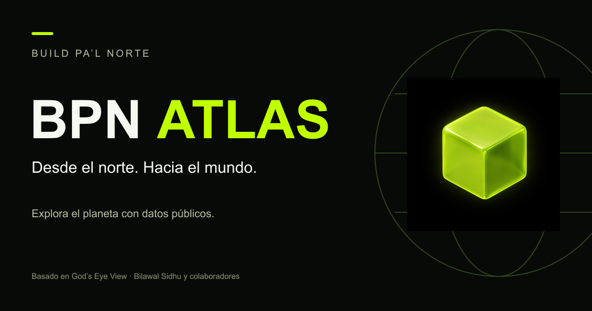

# BPN Atlas — Build Pa’l Norte

Desde el norte. Hacia el mundo.

Adaptación de [God’s Eye View](https://github.com/bilawalsidhu/gods-eye-view), de Bilawal Sidhu y colaboradores. Conserva el globo, las capas de datos, las escenas, la voz opcional y las herramientas originales; añade la identidad de Build Pa’l Norte.



## Ejecutar en tu computadora

Necesitas Node 24.14 o posterior dentro de la versión 24, o Node 26.

```sh
git clone https://github.com/Felglitch739/bpn-atlas.git
cd bpn-atlas
npm ci
npm run doctor
npm run dev
```

Abre http://localhost:4173. El globo inicia sin claves; las capacidades adicionales dependen de cada proveedor. Puedes configurarlas desde POWER UP en tu instalación local.

## Identidad BPN

Cubo raster original, lima #C0FF00, carbón, Montserrat en títulos y Outfit en la interfaz. La bienvenida se presenta en español; los controles técnicos y las lecturas originales conservan su idioma. La capa de marca vive en src/ui/styles/bpn.css y no cambia los colores de los datos ni los filtros del mapa.

## Créditos y licencias

El trabajo original y sus avisos se conservan en [LICENSE](LICENSE), [THIRD_PARTY_NOTICES.md](THIRD_PARTY_NOTICES.md) y [DATA_SOURCES.md](DATA_SOURCES.md). El código base es MIT. Los datos, imágenes y modelos tienen licencias independientes. El cubo y la identidad BPN no se incluyen en la concesión MIT del código original.

El README original se conserva en [README.upstream.md](README.upstream.md). No se atribuyen a BPN los reconocimientos, cifras ni contribuciones del proyecto original.

## Publicación

Consulta [docs/BPN-LAUNCH.md](docs/BPN-LAUNCH.md). Una compilación estática no sustituye al servidor que necesitan muchas fuentes, la voz y las herramientas. El rebranding no garantiza disponibilidad de todos los proveedores.
